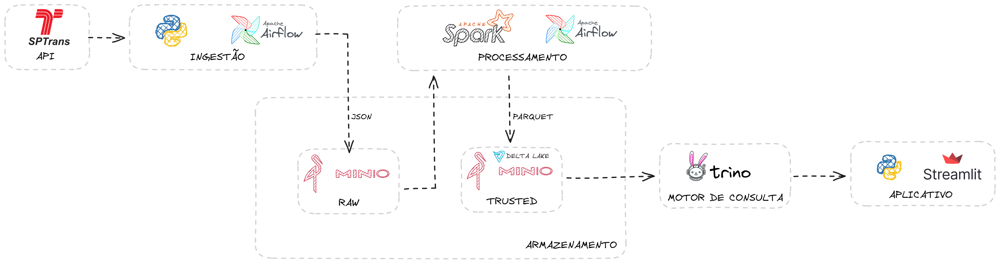
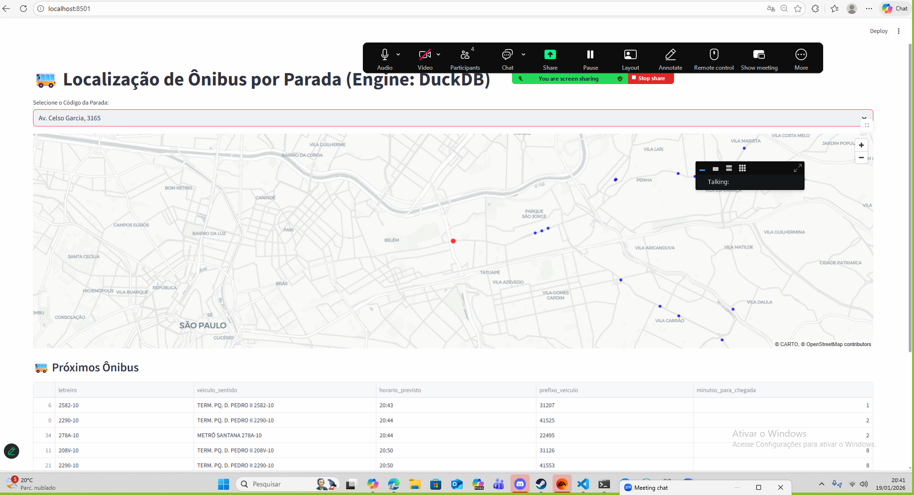

## Monitoramento da Frota de Ônibus – SPTrans​ - Pipeline de Dados em Tempo Quase Real

Este repositório contém uma configuração do Apache Airflow utilizando Docker e Docker Compose. O projeto inclui DAGs relacionadas com a camada raw e trusted para ingestão de dados a partir da API pública Olho vivo da SPTrans (documentação: https://www.sptrans.com.br/desenvolvedores/api-do-olho-vivo-guia-de-referencia/documentacao-api/) com armazenamento no Minio.

## Objetivo do Trabalho

O objetivo deste projeto foi desenvolver uma pipeline de dados moderna, automatizada e escalável, capaz de:​

- Ingerir dados da API OLHO VIVO da SPTrans​
- Processar informações em near real-time (a cada 2 minutos)
- Estruturar dados para análises operacionais​
- Disponibilizar informações para visualização geoespacial e BI​

## Contextualização do Problema

Grandes centros urbanos possuem alta complexidade operacional no transporte público​
A SPTrans disponibiliza dados em tempo real, porém:​
- Em formato bruto​.
- Sem estrutura analítica​.
- Com alto volume e alta frequência​.

Há necessidade de:​
- Monitoramento contínuo da frota​.
- Previsão de chegada por parada​.
- Apoio à gestão operacional​.

## Fonte de Dados

API pública da SPTrans – OLHO VIVO​
    - http://api.olhovivo.sptrans.com.br/v2.1

Principais endpoints utilizados:​

- /Posicao​
- /Previsao/Parada​

Dados complementares:​
- GTFS (stops)​

Características dos dados​
- Alta frequência (a cada 2 minutos)​
- Dados semi-estruturados (JSON)

## Desafio de Engenharia de Dados

- Alto volume de dados em curto intervalo​
- Necessidade de processamento incremental​
- Organização e particionamento eficientes​
- Garantia de qualidade e rastreabilidade​
- Separação clara entre:​
    - Dado bruto​
    - Dado tratado​
    - Dado analítico

## Arquitetura de Dados

A arquitetura segue o padrão Lakehouse + Arquitetura medalhão, composta por 2 camadas:​
- Raw: dados brutos, sem transformação​
    - Dados ingeridos diretamente da API SPTrans​
    - Armazenamento no MinIO​
    - Formato: JSON​
    - Particionamento por (ano / mês / dia​)
    - Orquestração pelo Apache Airflow​
    - Preservar o dado original para auditoria e reprocessamento

- Trusted: dados tratados, normalizados e versionados​
    - Processamento com Apache Spark​
    - Aplicação de regras:​
        - Validação de schema​
        - Remoção de duplicidades​
        - Padronização de tipos​
    - Armazenamento em Delta Lake no MinIO​
    - Controle de versão e histórico

- Refined: dados prontos para consumo analítico
    - Dados consumidos via views SQL no Trino​
    - Leitura direta da camada Trusted (Delta Lake)​
    - Não há duplicação de dados​
    - Camada orientada a BI e visualização

### Orquestração

- Apache Airflow como orquestrador central​
- DAGs separadas por camada:​
    - Raw (fact e dim)​
    - Trusted (fact e dim)​
- Controle de dependências entre camadas​
- Execução:​
    - Fatos → a cada 2 minutos​
    - Dimensões → semanal

### Produto Final

Monitoramento de Ônibus SPTrans (High-Performance)

Dashboard interativo que permite visualizar a previsão de chegada dos ônibus em paradas específicas da cidade de São Paulo em near real-time.

### Configuração do Ambiente
- 1. Executar o comando docker compose up -d na pasta do projeto (PROJETOFIA)
- 2. Criar os Buckets "raw" e "trusted" e a acess key "projeto_final" (mesma senha) no Minio
- 3. Executar as intruções de configuração do Airflow que está no arquivo .readme na pasta [Airflow](#Airflow/README.md)
- 4. Ativar as dags no airflow
- 5. Depois da primeira execução de todas as Dags, executar no trino utilizando o Dbeaver os comantos SQL na pasta [trino](#trino\queries\queries_trino.sql).
- 6. O link do Streamlit para visualização das informações encontra-se em: http://localhost:8501/
