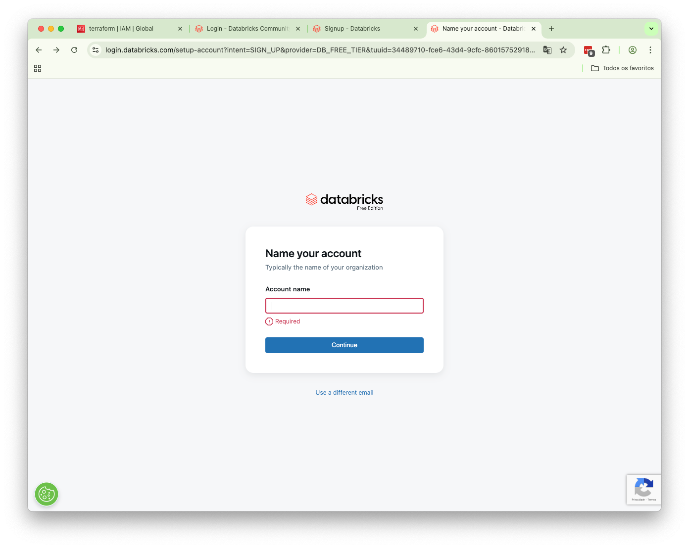
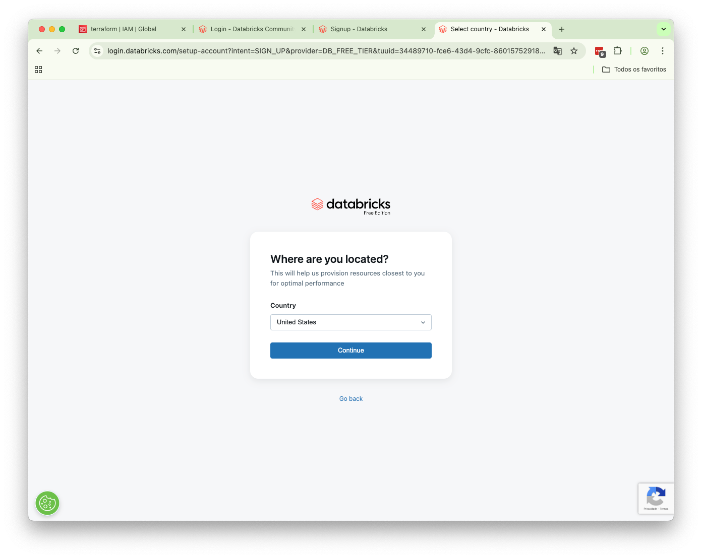
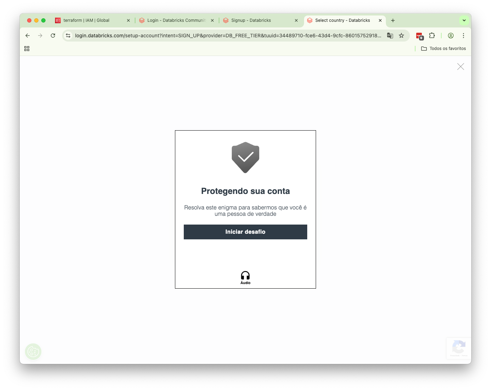
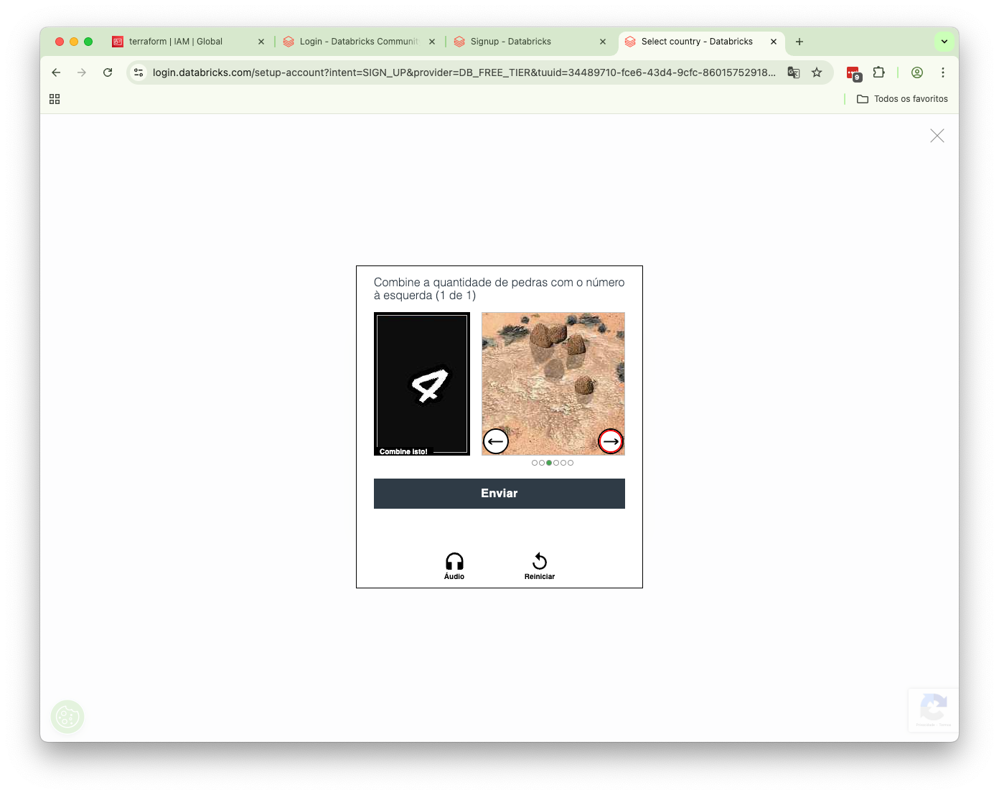
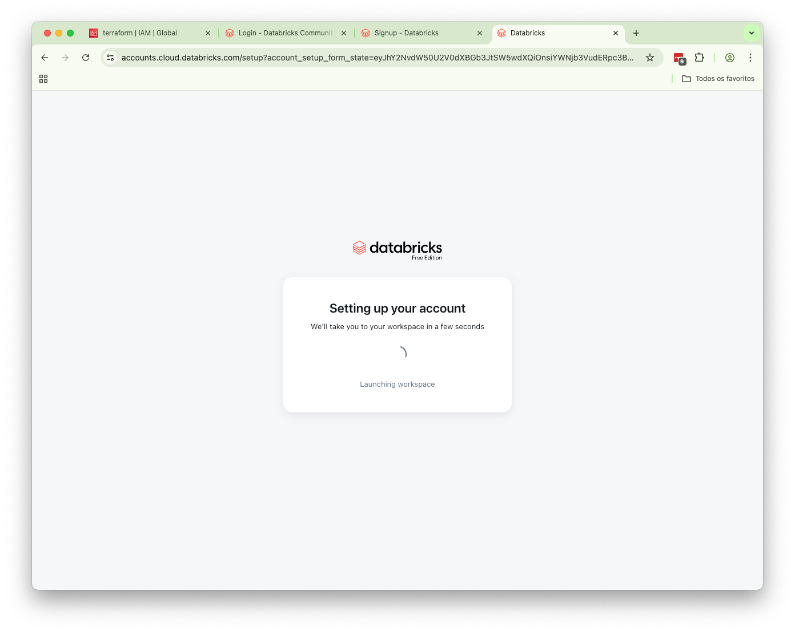
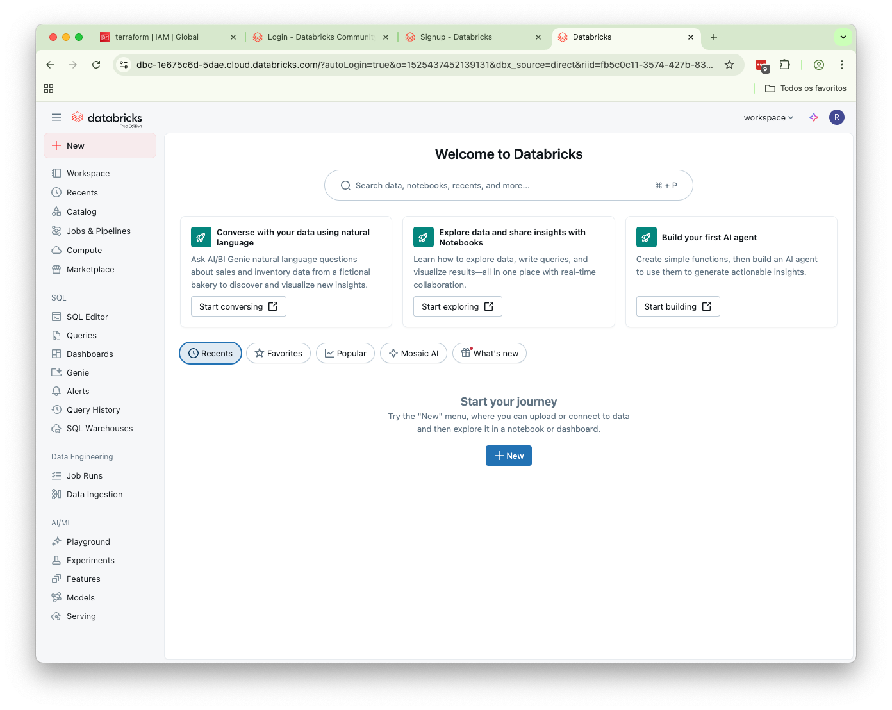

## Criação da conta gratuíta Databricks

A seguir, um guia passo a passo para a criação de uma conta no Databricks Community Edition, ideal para quem deseja explorar a plataforma gratuitamente.

### 1. Carregar a Página de Login

- **Acessar o link:**
    - Abra o navegador e acesse: [Databricks Login](https://community.cloud.databricks.com/login.html).
    - Você verá a tela de login conforme abaixo:

### 2. Iniciar o Cadastro

- **Clique em `Sign Up` para começar seu cadastro:**
    - A tela a seguir será apresentada:

### 3. Informar o nome da organização

- **Insira o próprio e-mail:**

### 4. Informar a localização

- **Será apresentada a tela abaixo:**

- **Escolher a localização Brazil**

### 5. Verificação de Segurança

- **Ajuste o Captcha conforme instruído:**
    - Direcione o avião na mesma direção que a mão aponta.

(No meu caso foi este 😀)

- **Será apresentada a tela abaixo sinalizando que vc venceu o desafio:**

### 6. Acesso ao Workspace

- **Bem-vindo ao Databricks!**
    - Após definir a senha, você será redirecionado ao workspace principal:

## Navegação
- [README](README.md)
- [Próximo](01-introducao.md)
